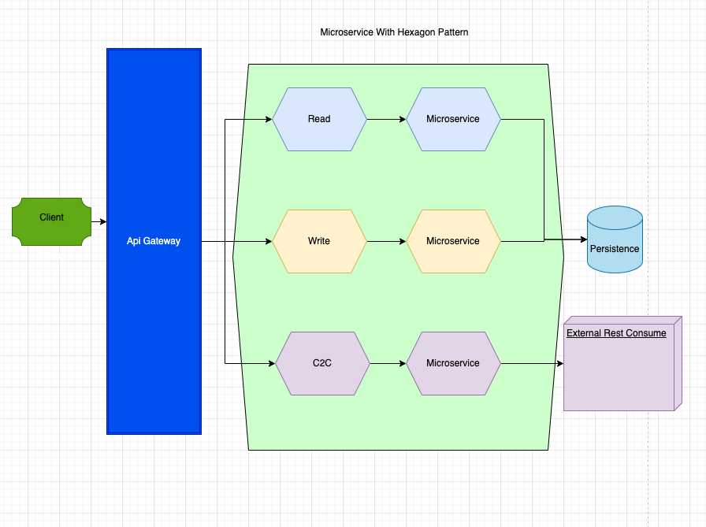

# PubApi in GO with  Hexagonal Architecture ANd Microservice

This is a basic Go application created using hexagon architecture  and golang with BDD for testing and bash scripts for best the performance

## First steps

### Go Runtime Version

1. Run migrations file  into your  persistence IDE and create the table
2. Run go mod tidy to get the dependencies
3. Use Make file to run coverage into test, get information in html fo test
4. run make linter to run a local CI 

### Architecture 

### Dependency management

This image has native support for Go Modules and requires the use of it as the dependency management tool.

